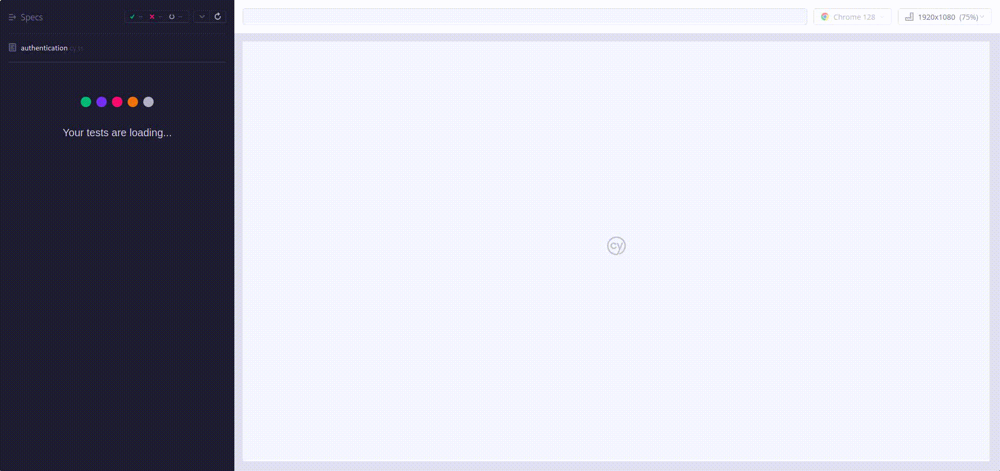

# Fullstack solid setup

## Project Setup

This repository provides a **common project setup** for web apps using **Vue**, **Node.js**, and essential tools for frontend and backend development, testing, and automation.

## Technologies

-   **Vue**: Popular frontend framework for building user interfaces.
-   **Vite**: Fast build tool for modern web development with support for hot module replacement.
-   **TypeScript**: Superset of JavaScript providing static typing for better code quality.
-   **Tailwind CSS**: Utility-first CSS framework for quickly styling components.
-   **Service Worker**: Enables background tasks and improves performance in Progressive Web Apps (PWA).

-   **Node.js**: JavaScript runtime for building scalable backend services.
-   **MySQL**: Relational database used for storing and managing data.

-   **Lerna**: Monorepo tool to manage multiple projects and dependencies.
-   **Prettier**: Code formatter that ensures consistent coding styles.
-   **ESLint**: Linter for identifying and fixing code quality issues.
-   **JSCPD**: Tool for detecting duplicate code across the codebase.
-   **Husky**: Git hooks tool used for running automated tasks such as code formatting with Prettier and linting with ESLint during pre-commit.

-   **Cypress**: Component and End-to-End testing framework for frontend applications.
-   **Jest**: Used in backend services for unit and integration testing.
-   **GitHub Actions**: CI/CD tool used to automate code quality checks, run Cypress tests, and manage workflows for pull requests and pushes.
-   **Vite Plugins**: Added for optimizing PWA features and removing unnecessary test case IDs in production builds.

-   **Error/Security Middlewares**: Handles error responses, security measures, and logs access/errors for auditing.

-   **Swagger**: Used for API documentation, providing a user-friendly interface to explore and test API endpoints.

## Quick Working Preview

### Setup and test command


### Cypress E2E testcase video



## Installation

1. Install dependencies:

    ```bash
    npm ci
    ```

2. Run backend migrations:

    ```bash
    lerna run migrate --stream --scope=backend
    ```

3. Create a `.env` file with database, port, and API key info.

## Development Workflow

-   Start the frontend and backend:
    ```bash
    lerna run dev --stream --scope=frontend --scope=backend
    ```
-   Run tests:

    ```bash
    lerna run test --stream --scope=backend
    lerna run cy:chrome --stream --scope=frontend -- --component

    # Need to run the app before end to end test
    lerna run dev --stream --scope=frontend --scope=backend -- --mode test
    lerna run cy:chrome --stream --scope=frontend -- --e2e
    ```

## Deployment

1. **Build**:

    ```bash
    lerna run build --stream --scope=frontend --scope=backend
    ```

2. **Deploy**:

    ```bash
    # Frontend
    pm2 serve FOLDER_NAME PORT --name APP_NAME --spa --time

    # Backend
    pm2 start INITIAL_FILE --name APP_NAME --time
    ```

3. **Nginx** configuration:

    ```nginx
    server {
        listen 443;
        server_name domain.com;

        # SSL configurations
        ssl_certificate      /path_to_ssl_certificate.crt;
        ssl_certificate_key  /path_to_ssl_certificate_key.key;

        # Proxy configurations
        # Backend API
        location /api/ {
            proxy_pass http://localhost:3006/;
            proxy_http_version 1.1;
            proxy_set_header Host $host;
            proxy_set_header X-Real-IP $remote_addr;
            proxy_set_header X-Forwarded-For $proxy_add_x_forwarded_for;
            proxy_set_header X-Forwarded-Proto $scheme;
        }

        # Frontend
        location / {
            proxy_pass http://localhost:3008/;
            proxy_http_version 1.1;
            proxy_set_header Host $host;
            proxy_set_header X-Real-IP $remote_addr;
            proxy_set_header X-Forwarded-For $proxy_add_x_forwarded_for;
            proxy_set_header X-Forwarded-Proto $scheme;
        }
    }
    ```

## GitHub Actions Workflow

This repository includes a GitHub Actions workflow for automating code quality checks and running Cypress End-to-End (E2E) tests on pull requests and pushes to the `master` branch.

### Workflow: Code Quality Check and Cypress E2E Test

The workflow is triggered on:

-   Pull requests targeting the `master` branch (on open, synchronize, and reopen events).
-   Push events to the `master` branch.

The workflow includes four jobs:

1. **Code Quality Check**:

    - **Run ESLint**: Runs ESLint to check for code quality issues with `npm run lint`.
    - **Run JSCPD**: Runs JSCPD to detect duplicate code with `npm run check-duplication`. If the duplication check fails, a summary of the results is uploaded to the GitHub summary.

2. **Backend Test**:

    - **MySQL Service**: Sets up a MySQL service for the backend tests.
    - **Backend Setup**: Installs dependencies, sets up the backend environment using environment variables, and runs database migrations.
    - **Jest Test**: Runs Jest tests for the backend.
    - **Test Result Upload**: If any tests fail, the results are uploaded as a summary.

3. **Cypress Component Test**:

    - **Node.js Setup**: Sets up Node.js (version 20.14.0) for the frontend.
    - **Frontend Setup**: Installs dependencies and sets up the frontend environment using environment variables.
    - **Cypress Component Testing**: Runs Cypress component tests.
    - **Upload Test Artifacts**: If any tests fail, artifacts such as screenshots are uploaded for further investigation.

4. **Cypress E2E Test**:
    - **MySQL Service**: Sets up a MySQL service for the E2E tests.
    - **Frontend and Backend Setup**: Installs dependencies and sets up both the frontend and backend environments using environment variables. Also runs backend migrations.
    - **Run Services**: Uses `lerna` to start both the frontend and backend services.
    - **Cypress E2E Testing**: Runs Cypress E2E tests against the running frontend and backend services.
    - **Upload Test Artifacts**: If any tests fail, artifacts like screenshots are uploaded for review.

This workflow ensures that every code change passes linting, code duplication checks, and comprehensive testing (unit, component, and E2E) before merging into the `master` branch.
